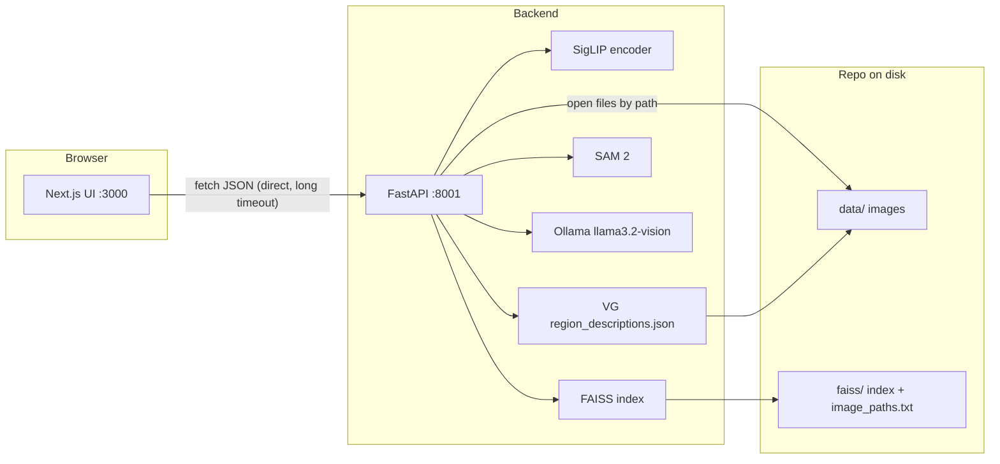

# VisualReF — Visual Relevance Feedback for Interactive Image Retrieval

Prototype from the RecSys ’25 demo paper: users search with natural language, click on image regions to mark what they want more or less of (**SAM 2** segmentation), and optionally use **Ollama + Llama 3.2 Vision** to auto-caption regions. On **Visual Genome**, human **region descriptions** are used when available (faster than vision-only captions). Feedback updates the query with **Rocchio**-style refinement over **SigLIP** embeddings and a **FAISS** index.

**Default corpus:** **Visual Genome** (~108k images). **COCO** (e.g. val2014) is optional.

**Stack:** FastAPI (`server/`) · Next.js (`client-next/`) · SigLIP retrieval · SAM 2 · Ollama `llama3.2-vision`.

---

## Citation

```bibtex
@inproceedings{10.1145/3705328.3759341,
  author    = {Khaertdinov, Bulat and Popa, Mirela and Tintarev, Nava},
  title     = {{VisualReF}: Interactive Image Search Prototype with Visual Relevance Feedback},
  year      = {2025},
  publisher = {Association for Computing Machinery},
  doi       = {10.1145/3705328.3759341},
  booktitle = {Proceedings of the Nineteenth {ACM} Conference on Recommender Systems},
  series    = {RecSys '25}
}
```

Example figures: `./assets/`.

---

## How the pieces connect (architecture)



1. **Indexing (offline)** — Images under `data/` are encoded with SigLIP; vectors go into `faiss/.../image_index.faiss`. The **same order** of rows is written to `image_paths.txt` (one filesystem path per line). For Visual Genome, if `region_descriptions.json` is present, phrase embeddings are **fused** with image embeddings (hybrid index).
2. **Search (runtime)** — The browser does **not** talk to Next.js API routes for retrieval. `client-next` uses `NEXT_PUBLIC_SERVER_URL` (default `http://127.0.0.1:8001`) and calls FastAPI **directly** so `/search`, `/segment`, and `/apply_feedback` can run for several minutes without a dev-server proxy timeout.
3. **Which corpus is live** — Controlled only by `server/.env`: `CONFIG_PATH` (YAML: model id, `IMG_SIZE`, corpus hint) and **`INDEX_PATH`** (the `.faiss` file). The repository default targets **Visual Genome** (see below).
4. **Paths** — Entries in `image_paths.txt` may be absolute or relative to the **repository root** (`visualref/`). The server resolves relatives via `server/src/config.py` (`resolve_repo`).

---

## Repository layout

| Path | Role |
|------|------|
| `start.sh` | Starts FastAPI (8001) + Next.js (3000), health checklist |
| `server/` | Backend: SigLIP, FAISS, SAM 2, VG region index, Ollama client |
| `server/.env` | **`CONFIG_PATH`**, **`INDEX_PATH`**, Ollama, `SAM_BACKEND=sam2` (copy from `.env.example`) |
| `server/.env.example` | Committed template; **Visual Genome** defaults |
| `server/venv/` | Python virtualenv (local; not committed) |
| `client-next/` | Next.js UI; **`NEXT_PUBLIC_SERVER_URL`** → backend |
| `client-next/.env.example` | Template for `.env.local` |
| `configs/demo/*.yaml` | Corpus yaml (`vg_siglip.yaml`; `coco_siglip.yaml` if you add COCO data) |
| **`data/`** | **Image corpora + VG metadata** (not in git; you download or link) |
| **`faiss/`** | **Built indexes:** `image_index.faiss` + `image_paths.txt` per dataset |
| `scripts/setup_models.sh` | SAM 2 + Ollama model setup |
| `scripts/download_visual_genome.sh` | Downloads VG images + `region_descriptions.json` + `image_data.json` |
| `scripts/build_index.sh` | Builds FAISS (+ VG hybrid if metadata present) |
| `scripts/build_all_indexes.sh` | Rebuilds the **Visual Genome** index (same as `build_index.sh` with no args) |

---

## Data directory structure (`data/`)

Everything you retrieve from should live under **`visualref/data/`** (repo root). Example:

```text
data/
└── visual_genome/                     # default corpus
    ├── VG_100K/
    ├── VG_100K_2/
    ├── region_descriptions.json      # VG region phrases (hybrid index + runtime phrases)
    └── image_data.json               # image metadata (distribution file)
```

**FAISS output** (separate from raw images):

```text
faiss/
└── visual_genome/
    └── google/siglip-large-patch16-256/
        ├── image_index.faiss
        └── image_paths.txt
```

After moving or re-downloading images, **rebuild** the matching index so `image_paths.txt` stays aligned.

---

## Prerequisites

| Requirement | Notes |
|-------------|--------|
| Python | 3.10–3.12 (3.11 used in dev) |
| Node.js | 18+ |
| Disk | VG ~15 GB images + JSON; HF cache; Ollama model weights (optional COCO is separate) |
| GPU | Optional; **MPS** (macOS) or **CUDA** speeds SigLIP, SAM 2, indexing |
| Ollama | Optional captions: [ollama.com](https://ollama.com) — `ollama pull llama3.2-vision` |
| Hugging Face | SAM 2 weights are public — no login required |

---

## New user: clone → Visual Genome → run

### 1. Clone

```bash
git clone <repo-url> visualref
cd visualref
```

### 2. Download Visual Genome (images + metadata)

From the **repository root** (~15 GB + metadata):

```bash
chmod +x scripts/download_visual_genome.sh   # once
bash scripts/download_visual_genome.sh
```

This populates `data/visual_genome/` with images, `region_descriptions.json`, and `image_data.json`.

### 3. Python backend

```bash
cd server
cp .env.example .env
python3 -m venv venv
source venv/bin/activate
pip install --upgrade pip
pip install -r requirements.txt
cd ..
```

### 4. SAM 2 + Ollama model (from repo root)

```bash
bash scripts/setup_models.sh
```

Ensure **Ollama** is installed; then in another terminal:

```bash
ollama serve
ollama pull llama3.2-vision
```

### 5. Build the Visual Genome FAISS index

From **repository root** (can take **1–2+ hours** on MPS/CPU; GPU helps):

```bash
bash scripts/build_index.sh
```

Uses SigLIP and, when `region_descriptions.json` exists, builds a **hybrid** image+text index.

### 6. Backend configuration (default = Visual Genome)

The template in `server/.env` should match:

```env
CONFIG_PATH=../configs/demo/vg_siglip.yaml
INDEX_PATH=../faiss/visual_genome/google/siglip-large-patch16-256/image_index.faiss
LOGS_PATH=../logs

OLLAMA_URL=http://127.0.0.1:11434
OLLAMA_MODEL=llama3.2-vision
OLLAMA_ENABLED=true

SAM_BACKEND=sam2
```

**Switching to COCO:** comment/uncomment the **COCO** lines in the same file (change **both** `CONFIG_PATH` and `INDEX_PATH`) and run `bash scripts/build_index.sh coco` first.

### 7. Frontend

```bash
cd client-next
cp .env.example .env.local
npm install
cd ..
```

Edit `.env.local` if the API is not on `http://127.0.0.1:8001`.

### 8. Start

From **repository root**:

```bash
chmod +x start.sh scripts/*.sh
./start.sh
```

`start.sh` will:

- Create **`server/.env`** or **`client-next/.env.local`** from **`.env.example`** if they are missing.
- **Refuse to start** until the **FAISS** file in `INDEX_PATH` and its sibling **`image_paths.txt`** exist (finish indexing first).

- **API:** http://localhost:8001 (`/health`, `/sam_status`, `/ollama_status`)
- **UI:** http://localhost:3000

First backend load may take minutes (SigLIP + SAM 2 + FAISS).

---

## Optional: MS-COCO val2014

Add images under `data/coco/val2014/`, then `bash scripts/build_index.sh coco`. Point `server/.env` at `configs/demo/coco_siglip.yaml` and the matching `faiss/coco/.../image_index.faiss` (see `.env.example`).

---

## Operations cheat sheet

| Task | Command / location |
|------|---------------------|
| Start app | `./start.sh` |
| Logs | `.logs/server.log`, `.logs/client.log` |
| Rebuild VG index | `bash scripts/build_index.sh` (or `bash scripts/build_index.sh vg`) |
| Rebuild COCO index | `bash scripts/build_index.sh coco` |
| Change corpus | New index + update **`CONFIG_PATH` + `INDEX_PATH`** in `server/.env` |
| Ports | `start.sh` frees 8001 / 3000; or `SERVER_PORT` / `CLIENT_PORT` |

---

## HTTP API (overview)

| Method | Path | Purpose |
|--------|------|---------|
| POST | `/search` | Text query → top‑k paths + base64 previews |
| POST | `/segment` | SAM 2 mask; VG corpus adds `vg_phrases` when available |
| POST | `/apply_feedback` | Rocchio update (SAM crops, text, VG phrases, optional Ollama) |
| POST | `/caption` | Ollama caption for one base64 region |
| GET | `/health`, `/sam_status`, `/ollama_status`, `/metrics` | Status |

---

## Troubleshooting

| Symptom | What to check |
|---------|----------------|
| `FAISS index file not found` | Run `build_index.sh` for your corpus; `INDEX_PATH` in `server/.env` |
| `Image path does not exist` | Rebuild index; keep `data/` paths stable or use absolute paths |
| Corrupt / 0-byte VG images | Index builder skips tiny files; re-run build if needed |
| SAM 2 load errors | Rerun `bash scripts/setup_models.sh`; verify outbound HTTPS to `huggingface.co` |
| Ollama unavailable | `ollama serve` + `ollama pull llama3.2-vision` |
| UI timeout / `ETIMEDOUT` | `NEXT_PUBLIC_SERVER_URL` must reach the machine running uvicorn (localhost or LAN IP) |
| Turbopack / lockfile warning | Stray `package-lock.json` outside `client-next` — remove or adjust Next config |

---

## Cloud GPU

See **[deploy/DEPLOY.md](deploy/DEPLOY.md)** for rsync, remote uvicorn, and local Next.js.

---

## Config directories

- **`configs/demo/`** — Retrieval yaml per dataset (`vg_siglip.yaml`, optional `coco_siglip.yaml`).
- VLM captions are served by **Ollama** (`server/.env`), not separate captioning configs.

---

## License

See [LICENSE](LICENSE).
