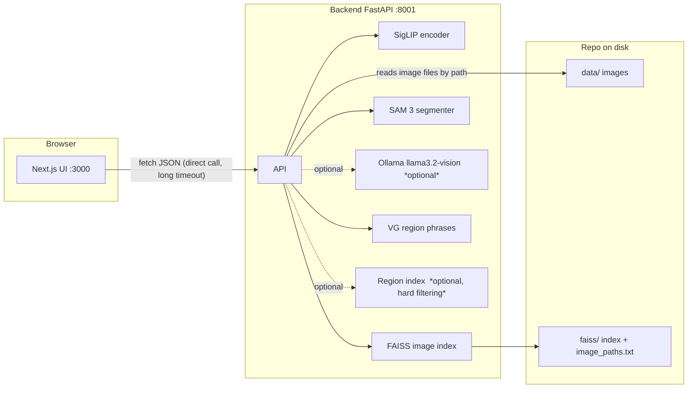

# VisualReF v2 — Visual Relevance Feedback for Interactive Image Retrieval

VisualReF is an interactive image search engine. You type what you're looking
for, the system shows results, and then — instead of just retyping your query —
you **click on the part of an image you want more of** (or less of). The system
turns that click into a precise object mask, learns from it, and refines the
search. Over a few rounds it converges on what you actually meant, even when
you couldn't put it into words at the start.

This is **v2**, an extension of the original RecSys '25 demo by Khaertdinov et
al. It adds pixel-precise region clicks, optional AI-generated region captions,
a "never show me this again" filter, and a modern web UI.

**Corpus:** Visual Genome (~108k images).
**Stack:** FastAPI backend · Next.js frontend · SigLIP embeddings · FAISS search · SAM 3 segmentation · (optional) Ollama + Llama 3.2 Vision captioning.

> **Looking for internals?** This README covers setup and running. For the
> architecture, the full feedback algorithm (Rocchio, fusion, hard filtering, all
> tuning parameters), the complete API, and the study system, see
> **[DOCUMENTATION.md](DOCUMENTATION.md)**.

---

## Table of contents

1. [What it does (in plain terms)](#what-it-does-in-plain-terms)
2. [How it works under the hood](#how-it-works-under-the-hood)
3. [Two ways to run it: with or without Ollama](#two-ways-to-run-it-with-or-without-ollama)
4. [Prerequisites](#prerequisites)
5. [First-time setup (step by step)](#first-time-setup-step-by-step)
6. [Running the app](#running-the-app)
7. [Viewing the presentation (no backend needed)](#viewing-the-presentation-no-backend-needed)
8. [Using the app](#using-the-app)
9. [Optional: hard-filtering index](#optional-hard-filtering-index)
10. [Repository layout](#repository-layout)
11. [Configuration reference](#configuration-reference)
12. [HTTP API](#http-api)
13. [Troubleshooting](#troubleshooting)
14. [Citation & license](#citation--license)

---

## What it does (in plain terms)

A normal image search takes your words and finds matching pictures. The problem:
you often **recognize** the right image when you see it but **can't describe it**
well enough up front. VisualReF closes that gap with feedback:

- **Search** with a text query → you get a grid of results.
- **Click an object** in a result you like → SAM 3 draws a precise mask around
  just that object, and only that object feeds back into the search (not the
  background clutter).
- **Mark things you don't want** the same way → those get pushed away.
- **Type optional hints** ("more like this but at night") to steer it.
- **Apply Feedback** → the query is refined and you get a better grid.
- Repeat until you find it. In our user study, people found a good image in
  ~3 rounds on average.

Two optional helpers make it smarter:

- **Auto-captions (Ollama):** an AI vision model describes the region you
  clicked ("a golden retriever near a stream"), giving the search a richer text
  signal than the raw pixels. This is **optional** — it needs decent hardware.
- **Hard filtering:** once you reject something, images containing visually
  similar objects are blacklisted for the rest of your session, so rejected
  content stops coming back.

---

## How it works under the hood


```mermaid
flowchart LR
  subgraph browser [Browser]
    UI[Next.js UI :3000]
  end
  subgraph backend [Backend  FastAPI :8001]
    API[API]
    SigLIP[SigLIP encoder]
    FAISS[FAISS image index]
    SAM[SAM 3 segmenter]
    Ollama[Ollama llama3.2-vision  *optional*]
    VGJSON[VG region phrases]
    RIDX[Region index  *optional, hard filtering*]
  end
  subgraph disk [Repo on disk]
    DATA[data/ images]
    IDX[faiss/ index + image_paths.txt]
  end

  UI -->|"fetch JSON (direct call, long timeout)"| API
  API --> SigLIP
  API --> FAISS
  API --> SAM
  API -. optional .-> Ollama
  API --> VGJSON
  API -. optional .-> RIDX
  FAISS --> IDX
  API -->|"reads image files by path"| DATA
```

The core idea: **everything lives in one shared "meaning space."** SigLIP maps
both images and text into the same 1024-dimensional vector space, so a picture
of a dog and the words "a dog" land close together. Search is just finding the
image vectors closest to your query vector, which FAISS does in milliseconds.

1. **Offline indexing** — Every image in `data/` is encoded by SigLIP into a
   vector and stored in a FAISS index (`faiss/.../image_index.faiss`). The
   matching file paths are written, in the same row order, to
   `image_paths.txt`. This is the slow one-time step.

2. **Search (runtime)** — Your text query is encoded by SigLIP; FAISS returns
   the nearest image vectors. The browser calls the FastAPI backend **directly**
   (via `NEXT_PUBLIC_SERVER_URL`), not through Next.js, so long operations like
   segmentation and feedback can run without a proxy timeout.

3. **Feedback (Rocchio update)** — Each region you mark contributes signals: the
   visual embedding of the clicked object, optionally a text caption of it
   (from Ollama or a human-written Visual Genome phrase), and any hint you typed.
   These are blended and used to nudge your query vector toward what you liked
   and away from what you didn't, then the search re-runs. Your refined query
   persists across rounds, so refinement is cumulative.

4. **Hard filtering (optional)** — If a separate region index is built, rejecting
   a region also blacklists corpus images containing visually similar objects
   for the rest of the session — a guarantee the soft Rocchio update can't make.

---

## Two ways to run it: with or without Ollama

The AI auto-captioning (Ollama + Llama 3.2 Vision) is **powerful but expensive**:
20–40 seconds per region on a Mac, and it needs a fair amount of RAM/GPU. So the
project is designed to run **fully without it**. The single switch is
`OLLAMA_ENABLED` in `server/.env`.

| Mode | `OLLAMA_ENABLED` | Ollama running? | What you get |
|------|------------------|-----------------|--------------|
| **Lightweight** (default) | `false` | not needed | Full pipeline minus AI captions. The text signal comes from human-written **Visual Genome region phrases** — instant, no extra hardware. **Recommended for weaker machines.** |
| **Full** | `true` | yes, model pulled | Adds AI-generated captions of each clicked region for a richer feedback signal. Needs a stronger GPU/Mac. |
| Safe fallback | `true` | no | The server detects Ollama is missing and **automatically falls back** to Visual Genome phrases. Nothing breaks. |

**The fallback is automatic and safe.** At startup the server checks whether
Ollama is reachable *and* the model is pulled (`check_ollama`). Only then does it
enable captioning; otherwise it quietly uses Visual Genome phrases. You will
never get a crash or a hang from a missing Ollama.

You don't need to decide forever — flip the flag and restart anytime.

### To run lightweight (no Ollama)

In `server/.env`:

```env
OLLAMA_ENABLED=false
```

That's it. Skip every Ollama step below.

### To run full (with Ollama)

1. Install Ollama: <https://ollama.com/download> (or `brew install ollama` on Mac).
2. In a separate terminal, start it and pull the model (one time, ~7.8 GB):
   ```bash
   ollama serve
   ollama pull llama3.2-vision
   ```
3. In `server/.env`:
   ```env
   OLLAMA_ENABLED=true
   OLLAMA_URL=http://127.0.0.1:11434
   OLLAMA_MODEL=llama3.2-vision
   ```
4. Start VisualReF. Confirm it picked Ollama up:
   ```bash
   curl -s http://localhost:8001/health | grep ollama_available   # → true
   ```
   The backend log should also print `[startup] Ollama vision: available`.

---

## Prerequisites

| Requirement | Notes |
|-------------|-------|
| **Python** | 3.10–3.12 (3.11 used in development) |
| **Node.js** | 18 or newer |
| **Disk** | ~15 GB for Visual Genome images + JSON, plus a Hugging Face model cache, plus Ollama weights if used |
| **GPU** | Optional but helpful. Apple **MPS** (macOS) or **CUDA** (NVIDIA) speeds up indexing, SigLIP, and SAM 3. CPU works but indexing is slow. |
| **Ollama** | Only for full mode — see [above](#two-ways-to-run-it-with-or-without-ollama) |
| **Hugging Face** | SAM 3 weights may be gated; run `huggingface-cli login` and accept the model terms if downloads fail |

---

## First-time setup (step by step)

All commands are run from the **repository root** (`visualref/`) unless stated.

### 1. Clone

```bash
git clone <repo-url> visualref
cd visualref
```

### 2. Download Visual Genome (images + metadata, ~15 GB)

```bash
chmod +x scripts/download_visual_genome.sh
bash scripts/download_visual_genome.sh
```

This fills `data/visual_genome/` with the images, `region_descriptions.json`
(the human-written region phrases), and `image_data.json`.

### 3. Set up the Python backend

```bash
cd server
cp .env.example .env
python3 -m venv venv
source venv/bin/activate
pip install --upgrade pip
pip install -r requirements.txt
cd ..
```

### 4. Install the models (SAM 3, and optionally Ollama)

```bash
bash scripts/setup_models.sh
```

This installs the SAM 3 package and, if you want full mode, pulls the Ollama
model. **For lightweight mode you can skip the Ollama parts** — see
[Two ways to run it](#two-ways-to-run-it-with-or-without-ollama).

### 5. Build the FAISS image index (the slow step)

```bash
bash scripts/build_index.sh
```

This encodes every Visual Genome image with SigLIP and writes
`image_index.faiss` + `image_paths.txt`. **Expect 1–2+ hours on MPS/CPU**; a
CUDA GPU is much faster. You only do this once (re-run only if you change the
image set).

### 6. Choose your mode in `server/.env`

`cp .env.example .env` already gave you working defaults. Open `server/.env` and
set `OLLAMA_ENABLED` to `false` (lightweight) or `true` (full). The defaults:

```env
CONFIG_PATH=../configs/demo/vg_siglip.yaml
INDEX_PATH=../faiss/visual_genome/google/siglip-large-patch16-256/image_index.faiss
LOGS_PATH=../logs

OLLAMA_URL=http://127.0.0.1:11434
OLLAMA_MODEL=llama3.2-vision
OLLAMA_ENABLED=false       # ← false = lightweight, true = full (needs Ollama)

SAM_BACKEND=sam3
```

### 7. Set up the frontend

```bash
cd client-next
cp .env.example .env.local
npm install
cd ..
```

`.env.local` points the browser at the backend (`NEXT_PUBLIC_SERVER_URL`,
default `http://127.0.0.1:8001`). Only change it if the backend runs elsewhere.

---

## Running the app

From the repository root:

```bash
chmod +x start.sh scripts/*.sh    # first time only
./start.sh
```

`start.sh` does everything for you:

- Creates `server/.env` / `client-next/.env.local` from the examples if missing.
- **Refuses to start** until the FAISS index and its `image_paths.txt` exist
  (so finish step 5 first).
- Starts the backend (port **8001**) and frontend (port **3000**).
- Runs a health checklist showing what loaded (SigLIP, FAISS, SAM, VG phrases,
  Ollama, region index, GPU).

Then open **<http://localhost:3000>**.

> The first backend launch can take a few minutes while SigLIP, SAM 3, and the
> FAISS index load into memory. Subsequent restarts are faster.

Stop everything with **Ctrl+C**. Logs are in `.logs/server.log` and
`.logs/client.log`.

To change ports: `SERVER_PORT=8002 CLIENT_PORT=3001 ./start.sh`.

---

## Viewing the presentation (no backend needed)

The slide deck at `/present` is a self-contained Next.js page — it has no
dependency on the Python server, SAM, or any GPU. Only Node.js is required.

```bash
cd client-next
npm install          # first time only
npm run dev
```

Then open **<http://localhost:3000/present>**.

Navigate with:

| Key | Action |
|-----|--------|
| Arrow Right / Space / PageDown | Next slide or next step |
| Arrow Left / PageUp | Previous |
| Home | First slide |
| End | Last slide |
| Click a dot (bottom bar) | Jump to any slide |
| × (top right) | Exit to main app |

> The main app at `http://localhost:3000` is also accessible but search will not
> work without the backend running — that is expected.

---

## Using the app

1. **Type a query** and search — you get a grid of result images.
2. **Click on an object** in an image you like. SAM 3 outlines it; it's marked
   **Relevant** (green). Click an object you dislike and toggle it to
   **Irrelevant** (red). You can also mark a **whole image** Relevant/Irrelevant
   without clicking, as a quick low-effort signal.
3. **(Optional) type hints** in the feedback panel — positive ("on a beach") or
   negative ("no people").
4. In full mode, **captions appear automatically** for each region you click
   (they generate in the background while you work). You can hit "Use" to drop a
   caption or a Visual Genome phrase into your hint box as a starting point.
5. Click **Apply Feedback**. The grid refreshes with a refined search.
6. Repeat until satisfied.

### Study mode

A guided **study mode** at <http://localhost:3000/study> runs the user-study
target-finding tasks. It shows a participant an "archivist" cover story and a
target image, has them search and refine to find a match, and logs every round to
`logs/study/{id}.jsonl` (plus a post-task questionnaire to `{id}.form.json`).
Regular use doesn't need it.

The three tasks (zebra, tower, "lid") are defined in
`server/src/eval/data/queries.json`. **If that file is missing, the study button
errors with `503 "Study query set not built"`** — it holds the task definitions and
ground-truth relevant sets. Analyze collected runs with
`python -m src.eval.analyze_study` (from `server/`). Full details in
[DOCUMENTATION.md §14](DOCUMENTATION.md#14-the-user-study-system).

---

## Optional: hard-filtering index

Hard filtering ("never show me images with this object again") needs a second,
**region-level** index. It's optional — without it the app still works and just
relies on the soft Rocchio update. To build it:

```bash
cd server
./venv/bin/python -m src.precompute.build_region_index \
    --image-paths ../faiss/visual_genome/google/siglip-large-patch16-256/image_paths.txt \
    --vg-dir ../data/visual_genome \
    --output-dir ../faiss/visual_genome/google/siglip-large-patch16-256
# add  --limit 100  for a quick smoke test first
```

This crops every Visual Genome bounding box, encodes it with SigLIP, and writes
`region_index.faiss` + `region_meta.jsonl` next to the image index. The build is
**resumable** — if interrupted, re-run the same command and it continues from
where it stopped. The server auto-detects these files at startup and enables
hard filtering; if they're absent it prints a notice and carries on.

---

## Repository layout

| Path | Role |
|------|------|
| `start.sh` | One command to launch backend + frontend with a health checklist |
| `server/` | FastAPI backend: SigLIP, FAISS, SAM 3, VG phrases, Ollama client |
| `server/.env` | Your config — corpus paths, Ollama, SAM backend (copy of `.env.example`) |
| `server/.env.example` | Committed template with Visual Genome defaults |
| `server/requirements.txt` | Python dependencies |
| `server/src/retrieval_server_visual.py` | Main API server |
| `server/src/services/` | Retrieval, Rocchio feedback, region index (hard filtering) |
| `server/src/models/` | SigLIP, SAM, Ollama vision wrappers |
| `server/src/precompute/build_region_index.py` | Builds the optional hard-filter index |
| `server/src/eval/` | User-study analysis (`analyze_study.py`, `metrics.py`) |
| `server/src/eval/data/queries.json` | Study task definitions + ground truth (required by study mode) |
| `client-next/` | Next.js + React frontend |
| `client-next/.env.local` | Frontend config (`NEXT_PUBLIC_SERVER_URL`) |
| `configs/demo/vg_siglip.yaml` | Corpus config (model id, image size, top-k) |
| `data/` | Image corpus + VG metadata (downloaded, not in git) |
| `faiss/` | Built indexes: `image_index.faiss` + `image_paths.txt` |
| `scripts/` | Setup, download, and index-building scripts |
| `deploy/` | Cloud-GPU deployment notes (`DEPLOY.md`) |

### Data and index directory structure

```text
data/
└── visual_genome/
    ├── VG_100K/                  # images
    ├── VG_100K_2/               # more images
    ├── region_descriptions.json # human-written region phrases
    └── image_data.json          # image metadata

faiss/
└── visual_genome/google/siglip-large-patch16-256/
    ├── image_index.faiss        # the searchable image vectors
    ├── image_paths.txt          # one path per row, same order as the index
    ├── region_index.faiss       # optional — hard filtering
    └── region_meta.jsonl        # optional — hard filtering metadata
```

> If you move or re-download images, **rebuild the index** so `image_paths.txt`
> stays aligned with the vectors.

---

## Configuration reference

Everything that selects the corpus and models lives in **`server/.env`**:

| Key | Meaning |
|-----|---------|
| `CONFIG_PATH` | YAML describing the corpus and SigLIP model (`configs/demo/vg_siglip.yaml`) |
| `INDEX_PATH` | The `.faiss` file to search |
| `LOGS_PATH` | Where retrieval logs are written |
| `OLLAMA_ENABLED` | `true` = full mode with AI captions, `false` = lightweight |
| `OLLAMA_URL` / `OLLAMA_MODEL` | Ollama endpoint and model name |
| `SAM_BACKEND` | Segmentation backend (`sam3`) |
| `CORS_ORIGINS` | Allowed frontend origins |

Frontend (`client-next/.env.local`): `NEXT_PUBLIC_SERVER_URL` — the backend URL
the browser calls directly.

To switch corpora: build a new index, then point `CONFIG_PATH` + `INDEX_PATH` at it.

---

## HTTP API

| Method | Path | Purpose |
|--------|------|---------|
| POST | `/search` | Text query → top-k image paths + base64 previews |
| POST | `/segment` | SAM 3 mask for a click; adds VG phrases on the VG corpus |
| POST | `/apply_feedback` | Rocchio update from clicks, hints, phrases, and optional captions |
| POST | `/caption` | On-demand Ollama caption for one base64 region |
| GET | `/health` | Overall status, including `ollama_available`, index sizes |
| GET | `/sam_status` | Whether SAM loaded and which backend |
| GET | `/ollama_status` | Ollama reachability and model |
| GET | `/caption_cache_status` · `/caption_lookup` | Debug: async caption cache state |
| GET | `/metrics` | Index size, GPU backend, timings |
| GET | `/study/tasks` · POST `/study/log` · POST `/study/form` | User-study endpoints |

Full request/response detail and the algorithm internals are in
**[DOCUMENTATION.md](DOCUMENTATION.md)**.

---

## Troubleshooting

| Symptom | Fix |
|---------|-----|
| `FAISS index file not found` | Run `bash scripts/build_index.sh`; check `INDEX_PATH` in `server/.env` |
| `Image path does not exist` | Rebuild the index; keep `data/` paths stable or use absolute paths |
| Server won't start, "index/paths missing" | Finish step 5 (indexing) before `./start.sh` |
| SAM 3 / Hugging Face download errors | `huggingface-cli login` and accept the SAM 3 model terms |
| Captions never appear (full mode) | Ensure `ollama serve` is running, model pulled, `OLLAMA_ENABLED=true`; check `curl localhost:8001/health` for `ollama_available: true` |
| Captions slow / machine struggling | Switch to lightweight: `OLLAMA_ENABLED=false` and restart |
| UI timeout / `ETIMEDOUT` | `NEXT_PUBLIC_SERVER_URL` must reach the machine running uvicorn (localhost or LAN IP) |
| Hard filtering not active | Build the region index (see [above](#optional-hard-filtering-index)) |
| Corrupt / 0-byte VG images | The index builder skips tiny files; re-run the build |

For cloud-GPU deployment (remote uvicorn, local Next.js), see
[deploy/DEPLOY.md](deploy/DEPLOY.md).

---

## Citation & license

This work builds on the original VisualReF demo:

```bibtex
@inproceedings{10.1145/3705328.3759341,
  author    = {Khaertdinov, Bulat and Popa, Mirela and Tintarev, Nava},
  title     = {{VisualReF}: Interactive Image Search Prototype with Visual Relevance Feedback},
  year      = {2025},
  publisher = {Association for Computing Machinery},
  doi       = {10.1145/3705328.3759341},
  booktitle = {Proceedings of the Nineteenth {ACM} Conference on Recommender Systems},
  series    = {RecSys '25}
}
```

Example figures live in `./assets/`. SAM 3 is used under Meta's open model
licence; Visual Genome is released under CC BY 4.0. See [LICENSE](LICENSE) for
this project's license.
